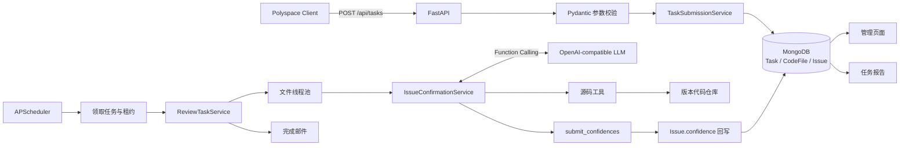

# ai-issue-checker 项目架构与完整任务流程

`ai-issue-checker` 采用“FastAPI 接收任务 + MongoDB 持久化 + APScheduler 租约调度 + 文件级并发 + LLM function calling 二次确认 + 静态管理报告”的架构。

核心目标不是重新运行 Polyspace，而是让 LLM 读取真实源码，对 Polyspace 已发现的每条 issue 判断“它是否确实是一个真实缺陷”，并把判断结果以 `0~1` 的 `confidence` 写回原 Issue。

## 一、总体技术架构



从职责上分为六层：

1. API 接入层：接收 Polyspace 数据、查询任务、提供报告和源码接口。
2. 数据校验层：校验路径、字段长度、Issue ID、文件名唯一性。
3. 持久化层：Task、CodeFile、Issue 和 LLM 调用轨迹。
4. 调度执行层：任务轮询、租约、心跳、恢复、文件并发。
5. AI 确认层：多轮 function calling、源码取证、置信度提交。
6. 展示通知层：任务列表、人员统计、报告、源码查看和完成邮件。

## 二、项目目录结构

```text
ai-issue-checker/
├─ app/
│  ├─ main.py
│  │  └─ FastAPI 创建、MongoDB 生命周期、调度器启停、静态资源挂载
│  ├─ common/
│  │  └─ constants.py
│  │     └─ TaskType、Task/File 状态定义
│  ├─ core/
│  │  ├─ config.py
│  │  │  └─ MongoDB、调度、并发、LLM、源码限制、邮件配置
│  │  ├─ database.py
│  │  │  └─ MongoDB 连接、mongomock 测试连接
│  │  └─ exceptions.py
│  │     └─ 统一业务异常与 HTTP 响应
│  ├─ models/
│  │  ├─ task.py
│  │  │  └─ TaskModel
│  │  └─ code_file.py
│  │     └─ CodeFileModel、Issue、ModelRoundTrace、ToolCallTrace
│  ├─ schemas/
│  │  ├─ task.py
│  │  │  └─ Polyspace 入参、任务响应
│  │  ├─ report.py
│  │  │  └─ 报告、文件、Issue、源码响应
│  │  └─ admin.py
│  │     └─ 管理列表、人员统计响应
│  ├─ routes/
│  │  ├─ tasks.py
│  │  │  └─ 任务创建、查询、删除
│  │  ├─ admin.py
│  │  │  └─ 任务管理、人员统计
│  │  ├─ reports.py
│  │  │  └─ 报告页面、报告 API、源码 API
│  │  └─ health.py
│  │     └─ 应用及数据库健康检查
│  ├─ services/
│  │  ├─ task_submission.py
│  │  │  └─ 重复任务清理和新任务落库
│  │  ├─ scheduler.py
│  │  │  └─ 任务轮询、租约、心跳、中断恢复
│  │  ├─ review_service.py
│  │  │  └─ 文件并发、检查点、聚合、重试、通知
│  │  ├─ issue_confirmation.py
│  │  │  └─ LLM 多轮确认主流程
│  │  ├─ llm_client.py
│  │  │  └─ OpenAI-compatible chat/completions 调用
│  │  ├─ prompts.py
│  │  │  └─ System Prompt 和 Function Calling 工具定义
│  │  ├─ review_tools.py
│  │  │  └─ 源码读取、搜索、置信度提交工具
│  │  ├─ notification.py
│  │  ├─ email_service.py
│  │  ├─ report_service.py
│  │  ├─ source_service.py
│  │  ├─ admin_task_service.py
│  │  └─ author_stats_service.py
│  ├─ static/
│  │  ├─ admin_tasks.*
│  │  ├─ author_stats.*
│  │  ├─ author_detail.*
│  │  └─ report.*
│  └─ templates/
│     └─ review_completed_email.html
├─ tests/
│  ├─ test_api.py
│  ├─ test_review.py
│  └─ test_admin_report.py
├─ demo_data/
│  └─ polyspace_scan_v1.json
├─ docker-compose.yml
├─ Dockerfile
└─ requirements.txt
```

主要代码入口：

- [FastAPI 入口](app/main.py)
- [任务提交服务](app/services/task_submission.py)
- [后台调度器](app/services/scheduler.py)
- [任务执行服务](app/services/review_service.py)
- [Issue 确认服务](app/services/issue_confirmation.py)
- [源码及结果工具](app/services/review_tools.py)

## 三、核心数据模型

### 1. TaskModel

一条 Task 代表一次完整的 Polyspace 扫描结果，唯一业务键是：

```text
project_id + review_version
```

MongoDB 对这两个字段建立唯一索引，因此同一项目、同一版本只保留最新一次扫描。

| 类别 | 字段 |
|---|---|
| 任务身份 | `project_id`、`review_version`、`version_code_path` |
| 状态 | `task_type`、`state`、`completion_status`、`failure_message` |
| 汇总 | `file_num`、`reviewed_file_num`、`issue_num`、`red_issue_num`、`orange_issue_num`、`author_num` |
| LLM 指标 | `llm_prompt_tokens`、`llm_completion_tokens`、`llm_total_tokens`、`llm_call_count`、`llm_elapsed_ms` |
| 调度恢复 | `retry_count`、`next_retry_time`、`lease_owner`、`lease_token`、`lease_expires_at`、`heartbeat_time` |
| 通知 | `completion_email_sent` |
| 时间 | `create_time`、`update_time`、`process_time` |

### 2. CodeFileModel

Task 下每个文件对应一条 CodeFile。它是系统的最小执行和恢复检查点：

- 一个文件确认完成后，状态变为 `completed`。
- 后续任务恢复时不会再次调用模型处理这个文件。
- 失败或中断文件会重新处理。

主要字段包括：

- `task_id`
- `project_id`
- `review_version`
- `file_name`
- `file_author`
- `state`
- `issues`
- 文件级 Token、调用次数、耗时
- `model_rounds`
- `tool_calls`
- `task_lease_token`

### 3. Issue

Issue 嵌入在 CodeFile 中：

```text
issue_id
check
function
line
col
detail
severity_color
comment
confidence
```

前八项来自 Polyspace，`confidence` 是 AI 二次确认后增加的字段。系统逻辑上只改变 `confidence`，不会修改 Polyspace 原始内容。

### 4. 状态定义

| 状态值 | 含义 |
|---:|---|
| 0 | pending，等待执行 |
| 1 | running，正在执行 |
| 2 | completed，执行成功 |
| 3 | failed，执行失败或等待重试 |

Task 和 CodeFile 使用相同的状态值。

## 四、一个完整任务的全部流程

### 1. 应用启动

FastAPI 启动时执行以下操作：

1. 读取环境变量和 `.env`。
2. 连接 MongoDB。
3. 创建 `ReviewScheduler`。
4. 如果 `APP_ENABLE_SCHEDULER=true`，启动 APScheduler。
5. 挂载 API、管理页面和静态资源。
6. 应用关闭时停止调度器，等待正在执行的任务，然后断开 MongoDB。

每个应用实例内部一次只执行一个 Task；一个 Task 内部可以并发执行多个 CodeFile。如果部署多个应用实例，每个实例可以领取不同 Task，MongoDB 租约负责避免重复领取。

### 2. Polyspace 提交扫描结果

客户端调用：

```http
POST /api/tasks
Content-Type: application/json
```

请求首先经过 Pydantic 校验：

- `project_id`、`review_version`、`version_code_path` 不能为空。
- `file_name` 必须是相对路径。
- 拒绝 `../secret.c` 等目录穿越。
- 拒绝 `C:/...` 等绝对路径。
- 同一个 Task 内文件名不能重复。
- 同一个文件内 Issue ID 不能重复。
- `line >= 1`。
- `col >= 0`。

校验通过后进入 `TaskSubmissionService.submit()`。

### 3. 相同项目版本的数据替换

系统按 `project_id + review_version` 查询旧任务。如果找到旧 Task：

1. 删除旧 Task 下所有 CodeFile。
2. 删除旧 Task。
3. 创建新的 Task。
4. 创建本次请求的所有 CodeFile 和 Issue。

相同项目和版本不是增量更新，而是整体替换。

进程内通过 `Lock` 避免两个请求交错清理；跨进程通过 MongoDB 唯一索引防止同时保留两个 Task。如果批量插入 CodeFile 失败，系统会删除刚创建的 Task 和残留 CodeFile，避免留下半套数据。

### 4. 初始任务汇总

Task 创建时计算：

- 文件总数
- Issue 总数
- 红色 Issue 数
- 橙色 Issue 数
- 负责人数量

这些数量来自 Polyspace 原始数据，不依赖 LLM。

Task 和 CodeFile 初始状态都是 `pending`，所有 Issue 的 `confidence` 初始为 `null`。

### 5. 调度器扫描任务

APScheduler 默认每 5 秒轮询一次。候选任务包括 `pending`、`running` 和 `failed`。

- `pending`：没有有效租约时可以领取。
- `running`：只有租约已过期才允许重新领取，通常表示应用重启、worker 退出、机器异常或心跳停止。
- `failed`：必须满足重试次数未耗尽、租约已过期或不存在，并且 `next_retry_time` 已到。

### 6. 原子领取和租约

调度器带 Task ID、当前状态和原 lease token 条件执行 MongoDB `modify()`。领取成功后写入：

```text
state = running
completion_status = running
lease_owner = 当前 worker ID
lease_token = 新 UUID
lease_expires_at = 当前时间 + 租约时长
heartbeat_time = 当前时间
last_start_time = 当前时间
```

如果另一个 worker 已经修改状态或租约，本次领取失败。执行过程中调度器周期性更新心跳并延长 `lease_expires_at`。

### 7. 检查代码版本目录

开始任务前解析 `version_code_path`，要求：

- 路径必须存在。
- 必须是目录。
- 如果设置了 `CODE_REPOSITORY_ROOT`，版本目录必须位于这个根目录内。

如果目录不存在或越过允许根目录，整个 Task 进入失败重试流程。

### 8. 查询未完成文件

系统只查询 `state != completed` 的 CodeFile，因此 pending、failed 和上次中断遗留的 running 文件会重新执行，completed 文件不会再次调用模型，其原有置信度会被保留。

### 9. 文件并发执行

系统使用 `ThreadPoolExecutor` 并发处理文件，并发度是：

```text
min(FILE_CONCURRENCY, 未完成文件数)
```

每个文件执行前会：

1. 再次校验 Task 租约。
2. 原子把 CodeFile 状态改为 running。
3. 写入当前 Task 的 lease token。
4. 清理文件上一次失败信息。
5. 调用 `IssueConfirmationService.confirm()`。

## 五、如何确认 Polyspace Issue 的置信度

### 1. 置信度的语义

当前 Prompt 对置信度的定义是：

```text
1.0 = 几乎确定 Polyspace 报告的是一个真实缺陷
0.0 = 几乎确定这是误报
0~1 之间 = 根据源码证据仍存在不同程度的不确定性
```

这个值表示“该 Issue 是真实缺陷的可信程度”，不是 Polyspace 的严重等级，也不是代码质量分数。系统没有使用 `red = 0.9`、`orange = 0.6` 一类固定换算，`severity_color` 完全不会传给模型。

### 2. 实际传给 LLM 的数据

对于文件中的每条 Issue，只传递四个字段：

```json
{
  "check": "Division by zero",
  "function": "divide_unchecked()",
  "line": 5,
  "detail": "Warning: scalar division by zero may occur"
}
```

不会传递：

- Issue ID
- `col`
- `severity_color`
- `comment`
- `file_author`
- `project_id`
- `review_version`
- `file_name`

这样可以避免模型因为红色、橙色标签、负责人或 comment 等展示信息直接猜分。

### 3. 模型怎样知道当前文件

虽然文件名不进入用户 Prompt，但工具执行器持有当前 CodeFile 的 `file_name`。模型调用 `read_file()` 且不传 `file_path` 时，工具会自动读取当前 CodeFile。

### 4. System Prompt

System Prompt 要求模型：

1. 独立验证 Polyspace 结果。
2. 必须以仓库源码证据为依据。
3. 不允许根据 severity 推断置信度。
4. 每条 Issue 都要提交置信度。
5. 按输入的零基顺序提交。
6. 完成后调用 `task_done(state="DONE")`。

### 5. 模型可以使用的源码工具

#### `read_file`

读取当前文件或指定文件的源码，返回带行号的数据。模型通常先读取 Issue 行附近的源码，确认告警发生位置。

#### `file_find`

根据文件名片段在版本代码目录下查找文件，适合寻找头文件、同名模块、类型定义文件和函数所在文件。

#### `code_search`

在允许的仓库源码文件中进行文本或正则搜索。模型可以搜索变量来源、宏定义、边界常量、被调函数、调用点和参数检查逻辑。

#### `find_definition`、`find_references`、`call_graph`

搜索符号定义、引用或调用相关行。当前实现本质上是受限文本搜索，不是基于编译器 AST 的精确语义分析。

#### `submit_confidences`

按 Issue 输入位置提交置信度：

```json
{
  "items": [
    {"issue_index": 0, "confidence": 0.98},
    {"issue_index": 1, "confidence": 0.05}
  ]
}
```

`issue_index` 是 Issue 在输入数组中的零基位置，不是 Polyspace Issue ID。

#### `task_done`

全部置信度提交后调用：

```json
{
  "state": "DONE",
  "summary": "..."
}
```

如果置信度不完整，`task_done(DONE)` 会被拒绝，并告诉模型缺少哪些 Issue。

### 6. 一个典型的模型取证过程

以除零告警为例：

```text
check    = Division by zero
function = divide_unchecked()
line     = 5
detail   = scalar division by zero may occur
```

模型可能执行：

1. `read_file` 读取第 5 行上下文。
2. 找到表达式 `a / b`。
3. 检查函数内部是否有 `b == 0` 判断。
4. 使用 `find_references` 或 `code_search` 查找调用者。
5. 检查调用路径是否保证 `b != 0`。
6. 检查宏、前置条件和断言是否真正有效。
7. 根据证据提交置信度。

如果源码没有任何除数检查，模型应给出接近 `1.0` 的置信度；如果控制流可以证明除法只能在 `b != 0` 时执行，模型应给出接近 `0.0` 的置信度。

对于数组越界，模型会相应检查数组长度、index 来源、上下界检查、循环边界、宏展开后的范围和调用者传参约束。

### 7. 多轮 Function Calling

每一轮流程是：

1. 发送 system、Issue 四字段和此前工具结果。
2. 模型返回一个或多个 tool call。
3. 系统执行工具。
4. 把工具结果作为 `role=tool` 消息加入上下文。
5. 进入下一轮，让模型基于新增源码证据继续判断。
6. 模型最终调用 `submit_confidences`。
7. 模型调用 `task_done`。

默认最大轮数为 `LLM_MAX_TOOL_ROUNDS=30`，默认单文件总超时为 `LLM_FILE_TIMEOUT_SECONDS=600`。

每轮会保存模型名、Prompt tokens、Completion tokens、Total tokens、LLM 耗时和 finish reason。每次工具调用会保存轮次、tool call ID、工具名、耗时、成功状态和错误信息。

如果工具参数错误，系统不会立即终止任务，而是把错误作为 tool response 返回模型，使模型可以在下一轮修正。

### 8. LLM API 调用方式

调用 OpenAI-compatible API：

```http
POST {LLM_URL}/chat/completions
Authorization: Bearer {LLM_API_KEY}
```

主要参数包括：

```json
{
  "model": "deepseek-v4-flash",
  "temperature": 0.1,
  "messages": [],
  "tools": [],
  "tool_choice": "auto"
}
```

较低的 `temperature=0.1` 用于降低同一源码判断的随机波动。408、429、500、502、503、504、网络错误和响应解析错误可以重试，第一次失败后可切换到 `LLM_FALLBACK_MODEL`。

### 9. 置信度合法性校验

系统不会直接信任模型输出。`submit_confidences` 会检查：

- `items` 必须是数组。
- 每项必须是对象。
- 必须包含 `issue_index` 和 `confidence`。
- `issue_index` 必须在文件 Issue 范围内。
- `confidence` 必须满足 `0 <= confidence <= 1`。
- 文件中每个 Issue 都必须有结果。

模型可以分多次提交，系统按 `issue_index` 暂存；重复提交相同 index 时以最后一次合法值为准。只有置信度数量等于文件 Issue 数量，文件才能完成。

### 10. JSON 兼容回退

正常流程要求 function calling。如果模型没有返回 tool call，而是在文本中直接返回：

```json
{
  "confidences": [0.98, 0.05]
}
```

系统会尝试解析并转换成 `submit_confidences` 格式。只有数量完整且全部合法，JSON 回退才会视为完成，否则系统继续提示模型调用工具。

### 11. Mock 模式

满足任一条件时不调用真实 LLM：

```text
LLM_MOCK_ENABLED=true
LLM_URL 为空
```

Mock 模式会给文件内所有 Issue 写入 `confidence = 0.5`。生产环境必须设置 `LLM_MOCK_ENABLED=false` 并配置真实的 `LLM_URL` 和 `LLM_API_KEY`。

## 六、置信度如何回写

模型完成一个文件后，结果按 Issue 输入位置排列。文件服务逐项执行：

```python
for index, confidence in enumerate(result.confidences):
    claimed.issues[index].confidence = confidence
```

随后带 CodeFile ID、Task ID 和 `task_lease_token` 条件更新 MongoDB，写入：

- 更新后的 Issue 数组
- CodeFile completed 状态
- Token 数量
- LLM 调用次数
- LLM 耗时
- 文件处理耗时
- 模型轮次
- 工具调用轨迹

如果旧 worker 的租约已经被新 worker 替换，更新条件无法命中，旧 worker 不能覆盖新结果。

## 七、文件失败和任务恢复

文件确认失败时，CodeFile 更新为 failed，并保存异常类型、错误信息和处理耗时。线程池不会因为一个普通文件失败立即取消其它文件，其它文件仍可继续完成。

所有文件线程结束后，系统重新读取 Task 下全部 CodeFile：

- 全部完成：Task 变为 `completed`，清理失败信息和下次重试时间。
- 存在未完成文件：Task 变为 `failed`，`retry_count += 1`，并在还有重试次数时设置 `next_retry_time`。

下一次调度只处理未完成文件，已完成文件作为检查点保留。

## 八、部署中断如何恢复

假设一个 Task 有 10 个文件，其中 6 个 completed、2 个 running、2 个 pending，此时应用重启：

1. 原 worker 心跳停止。
2. Task lease 到期。
3. 新 scheduler 领取这个 running Task。
4. 查询 `state != completed` 的文件。
5. 只重新处理后 4 个文件。
6. 前 6 个文件的 confidence 和调用指标保持不变。

如果同项目同版本在此期间重新提交，旧 Task 和文件会被删除；旧 worker 在下一次租约检查时会发现 Task 已不存在或 lease 已改变，停止旧结果回写。

## 九、任务完成聚合

文件处理结束后，Task 从所有 CodeFile 聚合：

- 已审核文件数
- Prompt tokens
- Completion tokens
- Total tokens
- LLM 调用次数
- LLM 累计耗时
- 任务处理耗时

多个文件并发调用 LLM，因此 LLM 累计耗时可能大于任务墙钟耗时。

## 十、邮件通知

Task 全部完成且 `completion_email_sent=false` 时：

1. 查询 Task 下全部文件。
2. 生成项目、版本、文件数、问题数和负责人汇总。
3. 给管理员邮箱发送。
4. 给所有唯一文件负责人发送。
5. 负责人不是完整邮箱时，拼接 `EMAIL_ACCOUNT_DOMAIN`。
6. 成功后写入 `completion_email_sent=true`。

当前 `EmailServer` 是与参考项目一致的可替换边界，实际实现为模板渲染和日志记录，并没有直接连接 SMTP 服务。

## 十一、报告和管理页面

### 任务管理

`/admin/tasks.html` 支持项目搜索、版本搜索、日期范围、任务状态、排序和分页。版本链接格式为：

```text
/reports/{project_id}/{review_version}.html
```

### 任务报告

报告显示项目和版本、任务状态、审核进度、问题汇总、Token 和调用指标、文件负责人、每条 Issue 的原始信息与 confidence，以及源码查看入口。

报告 API：

```text
GET /api/reports/projects/{project_id}/versions/{review_version}
```

### 人员统计

```text
/admin/authors.html
/admin/authors/{author}.html
```

用于按负责人统计相关项目、版本和红色、橙色问题。

## 十二、当前置信度机制的保证与边界

当前系统能够保证：

- 模型只看到指定的四个 Polyspace 字段。
- 严重等级不会直接影响模型输入。
- 模型可以读取真实版本源码取证。
- 路径访问被限制在版本目录内。
- 每个 Issue 必须有一个 `0~1` 结果。
- 置信度与 Issue 输入顺序严格对应。
- 未完整提交不能将文件置为成功。
- 旧 worker 不能覆盖新租约结果。
- 可以记录每轮模型和工具调用指标。
- 原始 Polyspace 数据不会被逻辑修改。

当前系统不能直接保证：

- `confidence=0.9` 在统计意义上一定有 90% 的准确率。
- 不同模型对相同问题一定产生完全相同的分数。
- LLM 判断一定正确。
- `find_definition`、`call_graph` 具有编译器级语义精度。
- 置信度经过人工标注数据校准。
- 已经实现多模型交叉投票或规则引擎复核。

因此当前 `confidence` 是“LLM 基于可访问源码证据给出的真实缺陷置信判断”。系统负责输入隔离、源码访问约束、结果完整性校验、按顺序回写、租约保护和失败恢复，但尚未进行概率校准或多模型一致性验证。
